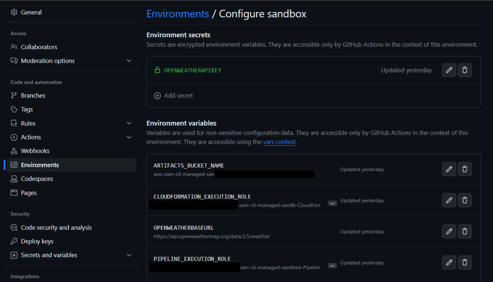

Repository used as an example for the [Call APIs from Step Functions using SAM](https://andmore.dev/http-invoke-with-sam) article.

# Deploy using the SAM CLI
## Clone/fork the repository
Clone or fork this repository and push it to your own GitHub account.

## Run sam deploy command
Run the following command replacing the api key value with yours
```bash
sam deploy --parameter-overrides FaunaDBSecretKey=YOUR_API_KEY
```

Running `sam deploy --guided` will not work as expected since the FaunaDBSecretKey parameter is set with the NoEcho attribute, for security reasons, which means it will not get saved in the samconfig.yaml.


# Deploy in your account using the included GitHub workflows
## Clone/fork the repository
Clone or fork this repository and push it to your own GitHub account.

## Setup GitHub environment
1. Create an GitHub environment named *sandbox*
2. Add your Pipeline Execution Role (PIPELINE_EXECUTION_ROLE), CloudFormation Execution Role (CLOUDFORMATION_EXECUTION_ROLE) and a target S3 bucket name for the artifacts (ARTIFACTS_BUCKET_NAME). Here is an explanation by [Chris Ebert](https://twitter.com/realchrisebert) on how to set this up.
3. Add the Base URL and the API Key for Open Weather. The Base URL is set as an Environment Variable named *OPENWEATHERBASEURL* and the API Key is set as a Secret named *FaunaDBSecretKey*



## Run Deployment
In the Actions in GitHub you can select the *Deploy to Sandbox* Workflow. There will be a button to *Run workflow* where you can now select the branch you wish to deploy.


